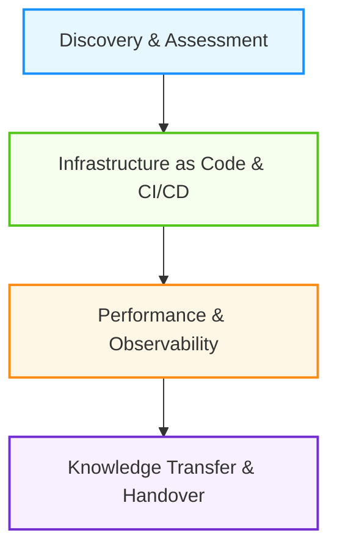
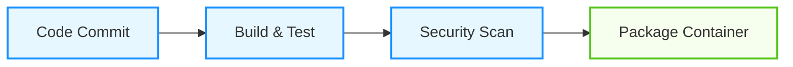
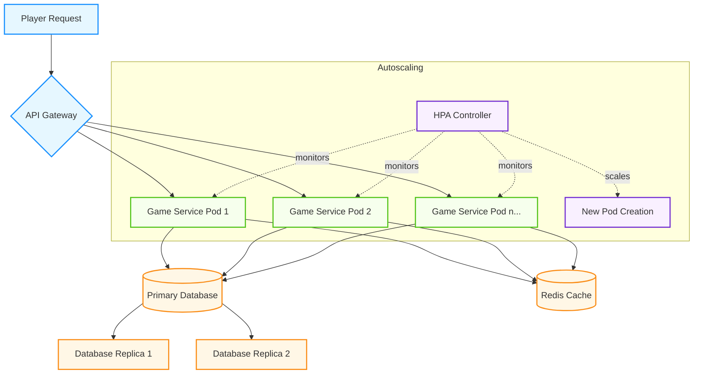

# Onboarding the Development Team for Game Server Launch
## DevOps Advocate Presentation

---

## Situation Analysis

- **Team Context**: C# development team focused on features
- **Challenge**: No deployment plan for production
- **Constraints**: Must use in-house Kubernetes platform
- **Scale**: Millions of active players per day
- **Goal**: Team must independently manage application post-launch

---

## Approach: 4-Phase Plan



1. **Discovery & Assessment**
2. **Infrastructure as Code & CI/CD**
3. **Performance & Observability**
4. **Knowledge Transfer & Handover** (Ongoing)

---

## Phase 1: Discovery & Assessment

**Key Activities:**
- Understand internal Kubernetes and cloud platform**
- Application architecture review sessions
- Identify stateful vs. stateless components
- Map external dependencies and data flows
- Document configuration requirements
- Establish initial performance baselines


**Deliverables:**
- Architecture diagram for Kubernetes deployment(ADR)
- Infrastructure requirements document

---

## Phase 2: Infrastructure as Code & CI/CD

**Containerization Strategy:**
- Multi-stage Docker builds optimized for C#/.NET
- Environment-specific configuration management
- Secrets handling approach

**Kubernetes Resources:**
```yaml
# Key resources we'll implement:
- Deployments/StatefulSets
- Services (ClusterIP, LoadBalancer)
- Ingress configurations
- ConfigMaps & Secrets
- HorizontalPodAutoscalers
- ServiceMonitor
- Logging configuration
```

**Infrastructure provisioning and lifecycle:**
- Terraform("Infrastructure as Code") implementation
    - Cluster provisioning
    - Dependent services provisioning
- Associated lifecycle automation

**CI/CD Pipeline:**

```mermaid
flowchart LR
    tag[commit version tag] --> build
    build --> package[Container]
    package --> devdeploy[Deploy to Dev]
    devdeploy --> integration[Integration Tests]
    integration --> stagingdeploy[Deploy to Staging]
    stagingdeploy --> load[Load Tests]
    load --> proddeploy[Deploy to Production]
    
    classDef blue fill:#e6f7ff,stroke:#1890ff,stroke-width:2px
    classDef green fill:#f6ffed,stroke:#52c41a,stroke-width:2px
    classDef orange fill:#fff7e6,stroke:#fa8c16,stroke-width:2px
    classDef purple fill:#f9f0ff,stroke:#722ed1,stroke-width:2px
    
    class tag,build,scan blue
    class package,devdeploy green
    class integration,stagingdeploy orange
    class load,proddeploy purple
```




---

## Phase 3: Performance & Observability

**Performance Testing Strategy:**
- Implement load testing with realistic player scenarios
- Identify bottlenecks through distributed tracing
- Optimize resource utilization
- Test autoscaling policies
- Introduce metrics and SLI
- Establish SLO and buy in SLA - Part 1(Engineers/SRE)

**Observability Stack:**
- Application metrics with Prometheus
- Centralized logging with ELK/Loki
- Distributed tracing with Jaeger/OpenTelemetry
- Custom dashboards for game-specific metrics



---

## Phase 4: Knowledge Transfer & Handover

**Team Enablement:**
- Hands-on workshops vs. theoretical training
- "Infrastructure as Code" paired programming sessions
- On-call shadowing program
- War Games - Chaos testing
- Establish SLO and buy in SLA - Part 2(PM)

**SRE:**
- Runbooks for common scenarios
- Troubleshooting guides
- Architecture decision records(ADR)
- Post-mortem templates

---

## Critical Implementation Details

**Stateful Data Handling:**
- Session management strategy
- Database scaling approach
- Cache implementation for performance

**Security Considerations:**
- Network policies for pod communication
- Secret rotation strategy
- Image vulnerability scanning
- RBAC implementation

**Scaling Strategy:**
- Horizontal pod autoscaling configuration
- Node scaling policies
- Database connection pooling
- Queue-based workload distribution

---

## Team Engagement Strategy

**Overcoming Resistance:**
- Start with pain points (current deployment frustrations)
- Demonstrate velocity improvements with automation
- Create early wins through simplified local development
- Implement "DevOps Days" for hands-on practice

**Measuring Success:**
- Deployment frequency
- Change lead time
- MTTR (Mean Time To Recovery)
- Business metrics

---

## Post-Launch Support Model

**Transition to Self-Sufficiency:**
- Weekly office hours
- Incident response training
- Regular architecture reviews
- Continuous improvement cycles

**Long-term DevOps Advocacy:**
- Monthly capability assessments
- Technical debt reviews
- New tooling evaluations
- Cross-team knowledge sharing - share learnings both side

---

## Q&A

Thank you for your attention!